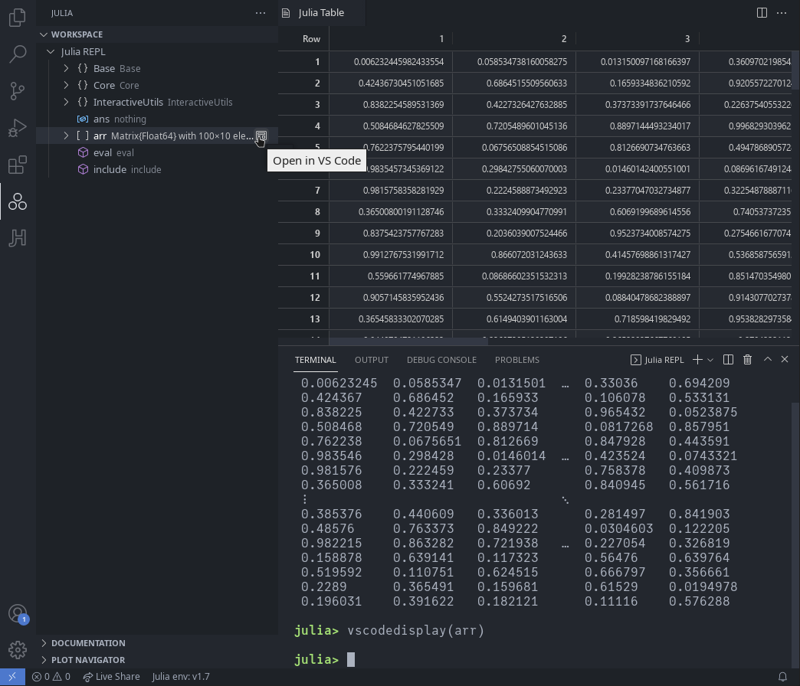

# Table Viewer

All [Tables.jl](https://github.com/JuliaData/Tables.jl)-compatible tables (and more!) can be displayed in the integrated table viewer.

You can use the exported `vscodedisplay` function to display an object directly or use the `Open in VS Code` button in the workspace:

`vscodedisplay` also takes an optional second argument that allows setting the tab title.

Tables can be filtered and sorted in the UI, although that may be slow for medium sized tables and is disabled for big tables (with more than 1e7 elements).

Note that not-big tables (by the above definition) are cached. As such, changes to the original data structure won't be reflected in the table viewer until you display the table again.

A slightly hidden feature is that you can select rows and copy them into the clipboard with Ctrl-C or the context menu. Note that this will be slow when many rows are selected.
