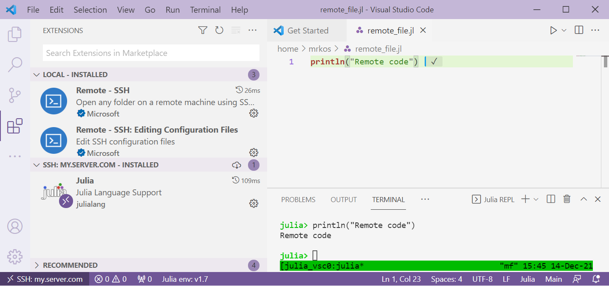

# Remote Development

To execute code on a remote server, you need to:

1. Make sure you have SSH access to the server
2. Install the [Remote-SSH](https://marketplace.visualstudio.com/items?itemName=ms-vscode-remote.remote-ssh) extension locally in VS Code
3. Connect VS Code to the server (using this icon in the bottom left of the VS code window: )
4. Install the [Julia extension](https://marketplace.visualstudio.com/items?itemName=julialang.language-julia) on the server through VS Code

Then, you can execute your code on the server the same way you would locally:

## Persistent server sessions

When you close the VS Code window, the server-side REPL terminates by default. To make the REPL state persistent across sessions, you have to:

1. Install `tmux`, a terminal multiplexer, on the server (e.g. with `apt install tmux`)
2. Toggle the `julia.PersistentSession.enabled` setting in the VS Code settings. Note that this setting is available only in the server installation of the Julia extensions, accessible from the second tab of settings:

